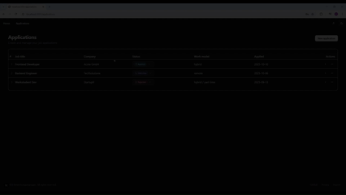

# Bewerbungsmanager (Job Application Manager) — Monorepo

Personal app to track job applications. Monorepo with **Frontend (Next.js/React)**, **Backend (TypeScript/Express/PostgreSQL)** and **shared Zod validation**. Backend uses **plain SQL in the model layer**, with **Drizzle Kit** only for schema & migrations (no ORM). API documented via **Swagger-UI**.

## 🎥 Demo Preview

*(Short demo of the web app showing dashboard, and application management features.)*

> 🎬 **Watch full demo video on YouTube:**  
> [Bewerbungsmanager – Full-Stack Web Application Demo](https://www.youtube.com/watch?v=zzHbA31GbZU)

> *(All data shown in the demo are anonymized.)*

## Features

- **Auth (JWT)**: register & login, protected routes
- **Applications CRUD**: create, list, update, delete
- **Notes per application**: scoped to the user’s application
- **Attachments**: multipart upload, file metadata in DB, files saved to local storage (`UPLOAD_DIR`)
- **Validation with Zod**: shared schemas used by FE (react-hook-form) & BE (controllers)
- **Unified error handling**: typed errors + Express error middleware
- **Swagger-UI**: live API docs at `/api/docs`
- **Plain SQL**: parameterized queries in the model layer
- **ESM/TypeScript** across the stack, **ESLint/Prettier** for quality

## Tech Stack

- **Frontend:** Next.js (React), TypeScript, Tailwind CSS, shadcn/ui
- **Backend:** Node.js (ESM), Express, TypeScript
- **DB:** PostgreSQL (hand-written SQL in models)
- **Validation:** Zod (shared package)
- **Docs:** Swagger-UI (OpenAPI 3)
- **Migrations:** Drizzle Kit (schema & SQL migrations only)
- **Package Manager:** Yarn Workspaces

## Monorepo Structure

apps/
frontend/ # Next.js app (dev: http://localhost:3001)
backend/ # Express API (dev: http://localhost:3000)
packages/
validation/ # Shared Zod schemas (e.g., userSchema, applicationSchema, helpers)